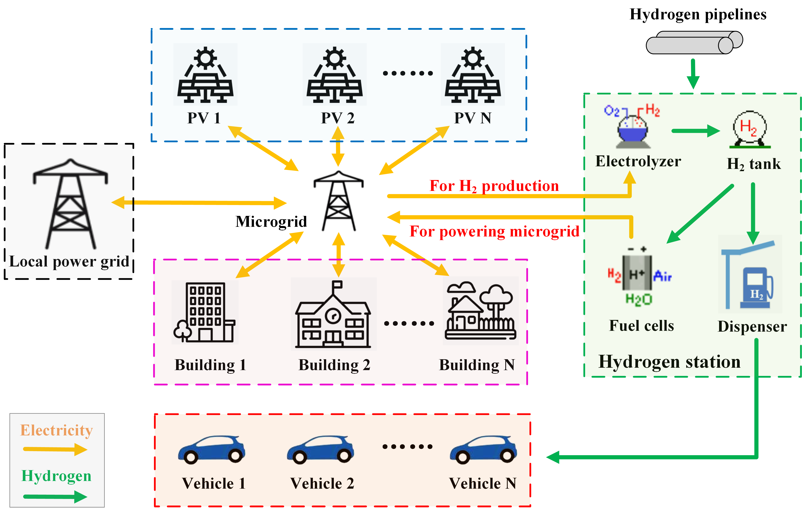
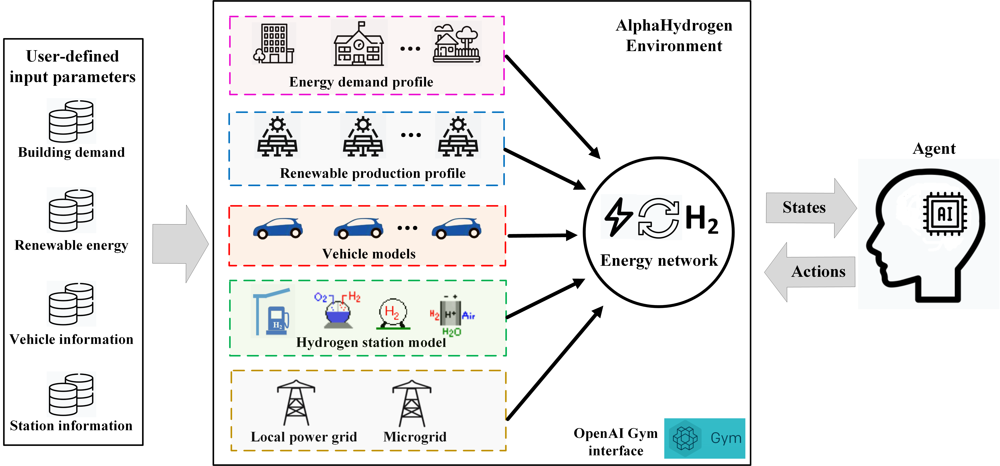

# AlphaHydrogen

AlphaHydrogen is an open source OpenAI Gym environment that simulates a regional energy network integrating buildings with distributed renewable power supply, fuel-cell vehicles, hydrogen stations, microgrid, and local power grid. Its objective is to advance the smart control of regional electricity-hydrogen energy networks supporting multiple buildings and hydrogen vehicles, for enhancing energy flexibility and CO2 emission reduction simultaneously.

# Overview
Cleaner power production, distributed renewable generation, building-vehicle integration, hydrogen (H2) storage and associated energy infrastructures are promising candidates for transformation towards a carbon-neutrality community with district energy flexibility enhancement. AlphaHydrogen allows the easy implementation of advanced control agents in a multi-agent setting to achieve customized goals: energy saving, load shifting, CO2 emission reduction, operational cost saving, and etc. 

The aimed energy network in this version:



The overview of AlphaHydrogen framework in this version:


# Code Usage
### Clone repository
```
git clone https://github.com/YingdongHe/AlphaHydrogen.git
cd AlphaHydrogen
```

### Set up the environment 
Set up the virtual environment with your preferred environment/package manager.

The instruction here is based on **conda**. ([Install conda](https://docs.anaconda.com/anaconda/install/))
```
conda create --name alphaHydrogen python=3.8 -c conda-forge --file requirements.txt
conda activate alphaHydrogen
```

### Repository structure
```
|
├── LICENSE
│
├── README.md
│
├── requirements.txt
│
├── gym_AlphaHydrogen
│   └── envs
│   │   ├──data
│   │   ├──inputs
│   │   ├──hydrogenCommunity.py
│   │   ├──model.py
│   │   ├──data_cleaning.ipynb
│   │   ├──Simulation.ipynb 
│   │   ├──test_gym.ipynb
│   │   └──test_model.ipynb
│   └── _init_.py
│
└── docs

```

``gym_AlphaHydrogen``: Code and data to develop the OpenAI Gym environment

``gym_AlphaHydrogen/envs/hydrogenCommunity.py``: Code of the environment

``gym_AlphaHydrogen/envs/model.py``: Individual models, including the model for vehicle, building, PV. grid, H2 station etc.

``gym_AlphaHydrogen/envs/inputs``: Input file of the environment

``gym_AlphaHydrogen/envs/Simulation.ipynb``: File to establish a regional electricity-hydrogen energy network with multiple buildings and vehicles and deploy smart control in the gym environment

``gym_AlphaHydrogen/envs/test_gym.ipynb``: File to test the gym environment

``gym_AlphaHydrogen/envs/test_model.ipynb``: File to test the model

``docs``: documents (papers, figures) related to this environment


### Running
You can set up your regional electricity-hydrogen energy network and run it using the Jupyter notebook ``gym_AlphaHydrogen/envs/Simulation.ipynb``

The corresponding guidance on establishing a regional electricity-hydrogen energy network and customizing energy management strategies is also represented in the above-stated file.

*Notes*
- Official Documentation of [OpenAI Gym](https://gym.openai.com/).

### Feedback

Feel free to send any questions/feedback to: [Zhe Wang](mailto:cezhewang@ust.hk ) or [Yingdong He](mailto:heyingdong2017@berkeley.edu)

### Clarification
Zhe Wang and Yingdong He contribute the same to the development of the environment.

# License
When using this software, please cite it:

Yingdong He, Zhe Wang. AlphaHydrogen. https://github.com/YingdongHe/AlphaHydrogen (2021).

Permission is hereby granted, free of charge, to any person obtaining a copy of this software and associated documentation files (the "Software"), to deal in the Software without restriction, including without limitation the rights to use, copy, modify, merge, publish, distribute, sublicense, and/or sell copies of the Software, and to permit persons to whom the Software is furnished to do so, subject to the following conditions:

The above copyright notice and this permission notice shall be included in all copies or substantial portions of the Software.

THE SOFTWARE IS PROVIDED "AS IS", WITHOUT WARRANTY OF ANY KIND, EXPRESS OR IMPLIED, INCLUDING BUT NOT LIMITED TO THE WARRANTIES OF MERCHANTABILITY, FITNESS FOR A PARTICULAR PURPOSE AND NONINFRINGEMENT. IN NO EVENT SHALL THE AUTHORS OR COPYRIGHT HOLDERS BE LIABLE FOR ANY CLAIM, DAMAGES OR OTHER LIABILITY, WHETHER IN AN ACTION OF CONTRACT, TORT OR OTHERWISE, ARISING FROM, OUT OF OR IN CONNECTION WITH THE SOFTWARE OR THE USE OR OTHER DEALINGS IN THE SOFTWARE.
